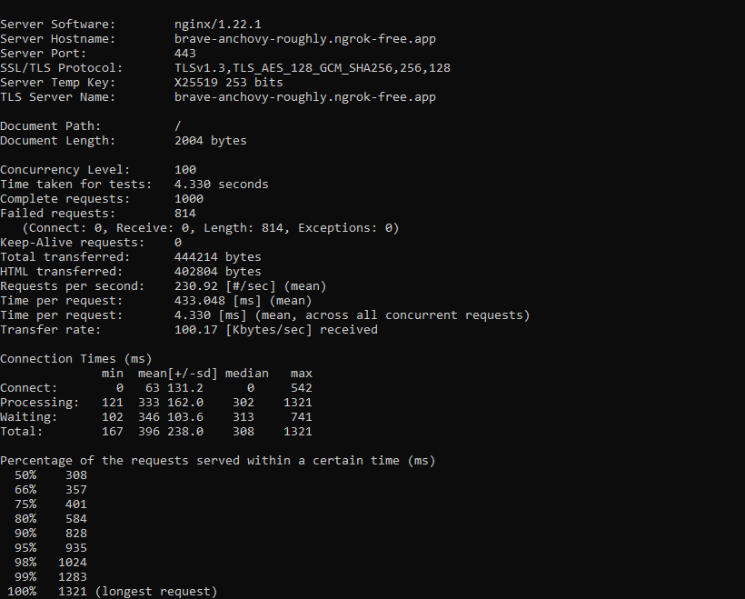
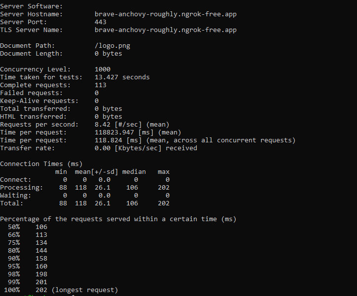
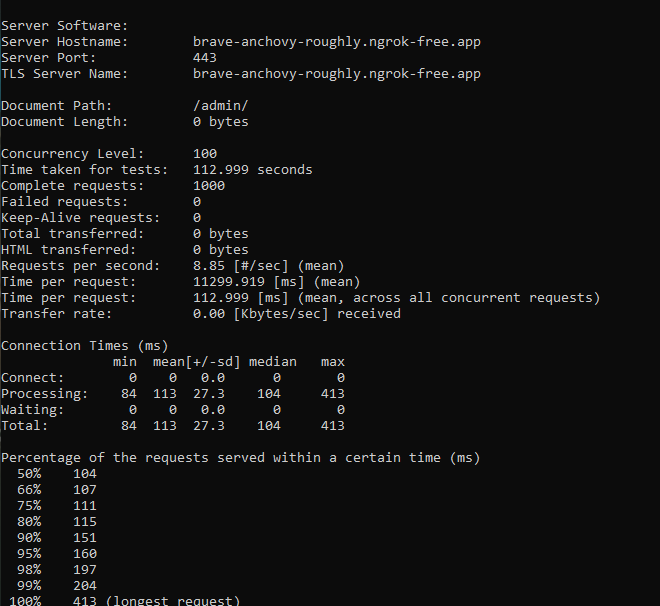
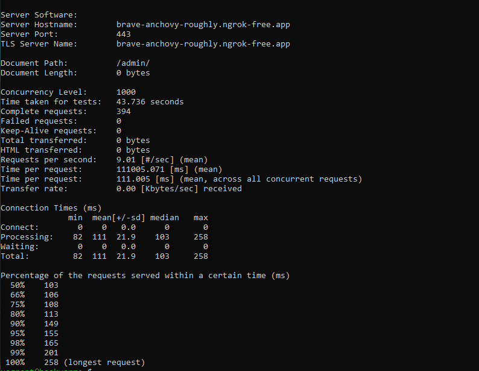

# Proyecto de Self Hosting con Nginx y Ansible en Vagrant

Este proyecto despliega un servidor web autogestionado utilizando Vagrant, Ansible y Nginx. Incluye funcionalidades como autenticación básica, generación de certificados SSL, un túnel público con Ngrok, monitorización en tiempo real con Netdata y pruebas de rendimiento.

## Tabla de Contenidos

1. [Requisitos Previos](#1-requisitos-previos)
2. [Estructura del Proyecto](#2-estructura-del-proyecto)
3. [Tecnologías Utilizadas](#3-tecnologías-utilizadas)
4. [Certificado SSL](#4-certificado-ssl)
5. [Autenticación Básica](#5-autenticación-básica)
6. [Página de Error Personalizada](#6-página-de-error-personalizada)
7. [Estado del Servidor](#7-estado-del-servidor)
8. [Pruebas de Rendimiento](#8-pruebas-de-rendimiento)
9. [Instalación y Configuración](#9-instalación-y-configuración)


## 1. Requisitos Previos

Antes de comenzar, asegúrate de tener instalado y configurado lo siguiente en tu máquina:

- **VirtualBox**: Versión recomendada 7.0 o superior.
- **Vagrant**: Herramienta para gestionar máquinas virtuales.
- **Conexión a Internet**: Necesaria para descargar dependencias y realizar configuraciones automáticas.

## 2. Estructura del Proyecto

```bash
vagrant-ansible-nginx/
├── Vagrantfile                # Archivo principal para Vagrant.
├── playbook.yml               # Playbook principal para Ansible.
├── files/
│   ├── index.html             # Página principal.
│   ├── admin.html             # Página de administración.
│   ├── 404.html               # Página de error 404.
│   ├── ngrok.yml              # Configuración de Ngrok.
│   └── README.md              # Este archivo.
```


## 3. Tecnologías Utilizadas

Este proyecto combina varias herramientas modernas para la automatización y el despliegue eficiente de un servidor web:

- **Vagrant**: Provisión de entornos virtuales.
- **Ansible**: Herramienta de automatización para la configuración y gestión de servidores.
- **Nginx**: Servidor web y proxy inverso de alto rendimiento.
- **Ngrok**: Permite exponer un servidor local a Internet de manera segura.
- **Netdata**: Sistema de monitorización en tiempo real.

## 4. Certificado SSL

Los certificados SSL se generan utilizando LetsEncrypt automáticamente gracias a Ngrok. 

## 5. Autenticación Básica

La autenticación básica en este servidor está configurada para proteger archivos específicos. Aquí hay un ejemplo de configuración en Ansible:


```bash
- name: Crear archivo de autenticación para admin
  shell: |
    echo -n 'admin:' > /etc/nginx/.htpasswd_admin
    openssl passwd -apr1 'asiri' >> /etc/nginx/.htpasswd_admin
```

## 6. Página de Error Personalizada

Una página de error personalizada se configura para mejorar la experiencia del usuario. Se ha creado una página de error 404 personalizada que proporciona unbotón de regreso.

## 7. Estado del Servidor

En un entorno de servidor web, es útil tener una página que permita visualizar el estado del servidor en tiempo real. Esto se puede lograr mediante la instalación de Netdata.

## 8. Pruebas de Rendimiento

Las pruebas de rendimiento son esenciales para evaluar la capacidad del servidor y su respuesta bajo diferentes niveles de carga. Para realizar estas pruebas, se utilizará **ApacheBench (ab)**, una herramienta de benchmarking que permite simular múltiples usuarios accediendo al servidor de manera concurrente.

### Comandos para las pruebas:

Los siguientes ejemplos de comandos están diseñados para probar el rendimiento del servidor con diferentes niveles de tráfico y diferentes tipos de recursos (páginas estáticas y dinámicas). En cada caso, se muestra el número de solicitudes totales (`-n`), el número de conexiones concurrentes (`-c`), y la opción de mantener las conexiones abiertas entre solicitudes (`-k`).

#### 1. **Prueba con 1000 solicitudes y 100 conexiones concurrentes**:
Este comando simula 1000 solicitudes a la página principal del servidor con 100 conexiones concurrentes.

```bash
ab -n 1000 -c 100 -k https://brave-anchovy-roughly.ngrok-free.app/
```
  
**Explicación**: En la imagen se muestra el tiempo total de la prueba y el rendimiento del servidor con 1000 solicitudes. El número de solicitudes exitosas, la tasa de transferencia y el tiempo promedio de respuesta se detallan aquí.

#### 2. **Prueba con 10000 solicitudes y 1000 conexiones concurrentes**:
Este comando aumenta significativamente la carga, simulando 10000 solicitudes simultáneas a la página principal con 1000 conexiones concurrentes.

```bash

ab -n 10000 -c 1000 -k https://brave-anchovy-roughly.ngrok-free.app/
```
  
**Explicación**: El gráfico muestra los efectos de una carga más alta. Con 10000 solicitudes y 1000 conexiones, el servidor puede experimentar un tiempo de respuesta más largo o incluso caídas, dependiendo de su capacidad de manejo de carga.

#### 3. **Prueba con 1000 solicitudes y 100 conexiones concurrentes (recurso estático)**:
En esta prueba, se simulan 1000 solicitudes concurrentes al recurso estático `logo.png`, lo que permite analizar cómo responde el servidor ante solicitudes de archivos estáticos.

```bash

ab -n 1000 -c 100 -k https://brave-anchovy-roughly.ngrok-free.app/logo.png
```
  
**Explicación**: Aquí, el servidor maneja solicitudes para un archivo estático (imagen). Los resultados muestran la capacidad del servidor para servir archivos sin procesamiento dinámico, lo que debería ser más rápido en comparación con las solicitudes dinámicas.

#### 4. **Prueba con 10000 solicitudes y 1000 conexiones concurrentes (recurso estático)**:
Aumentando la carga a 10000 solicitudes con 1000 conexiones concurrentes, se observa cómo el servidor maneja una cantidad elevada de tráfico al servir el recurso estático `logo.png`.

```bash

ab -n 10000 -c 1000 -k https://brave-anchovy-roughly.ngrok-free.app/logo.png
```
  
**Explicación**: Este gráfico muestra cómo el servidor responde a un volumen mucho mayor de solicitudes para un recurso estático. El rendimiento puede disminuir si el servidor no tiene suficientes recursos para manejar tantas solicitudes simultáneamente.

#### 5. **Prueba con 1000 solicitudes y 100 conexiones concurrentes (página de administración)**:
En este caso, el servidor recibe 1000 solicitudes a la página de administración, que puede ser más dinámica y consumir más recursos en comparación con las páginas estáticas.

```bash
ab -n 1000 -c 100 -k https://brave-anchovy-roughly.ngrok-free.app/admin/
```
  
**Explicación**: Al ser una página dinámica, el servidor puede experimentar tiempos de respuesta más largos debido a la carga adicional de procesar solicitudes en el backend (por ejemplo, consultas a bases de datos).

#### 6. **Prueba con 10000 solicitudes y 1000 conexiones concurrentes (página de administración)**:
Este comando simula 10000 solicitudes simultáneas a la página de administración, evaluando el rendimiento del servidor bajo una carga más intensa.

```bash

ab -n 10000 -c 1000 -k https://brave-anchovy-roughly.ngrok-free.app/admin/
```

  
**Explicación**: A medida que aumenta la carga, el servidor podría no ser capaz de manejar tantas solicitudes de manera eficiente. El gráfico muestra un tiempo de respuesta más alto, lo que puede indicar cuellos de botella en el servidor o en la infraestructura subyacente.

---

### Resumen de las Pruebas:

- **Comandos de prueba**: Los comandos varían en el número de solicitudes (`-n`) y conexiones concurrentes (`-c`), simulando diferentes escenarios de carga.
- **Imágenes de resultados**: Cada conjunto de imágenes muestra el desempeño del servidor durante las pruebas de carga, incluyendo tiempos de respuesta, tasa de transferencia y otros indicadores clave.
- **Impacto de la carga**: Las pruebas con mayor número de solicitudes y conexiones concurrentes tienden a aumentar los tiempos de respuesta, especialmente cuando se solicita contenido dinámico o cuando el servidor no tiene suficiente capacidad para manejar altas cantidades de tráfico.

---

Esta sección te proporciona una forma de evaluar cómo el servidor maneja distintos tipos de tráfico y recursos, y te ayuda a identificar áreas donde puede ser necesario mejorar la infraestructura o la configuración del servidor para optimizar el rendimiento.

## 9. Instalación y Configuración

Para instalar y configurar el servidor, sigue estos pasos:

1. Clona el repositorio:

```bash
   git clone https://github.com/Cosrrame/Self-Hosting.git
   cd Self-Hosting
```

2. Inicia la máquina virtual con Vagrant:

```bash
   vagrant up
```

3. Accede a tu servidor a través de Ngrok:

https://brave-anchovy-roughly.ngrok-free.app/


---

¡Gracias por tu interés en este proyecto! Si tienes alguna pregunta o sugerencia, no dudes en abrir un issue en el repositorio. 